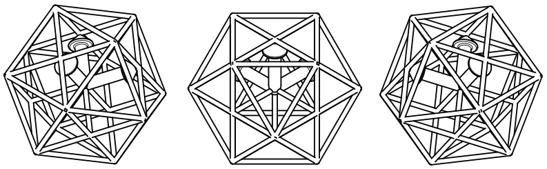
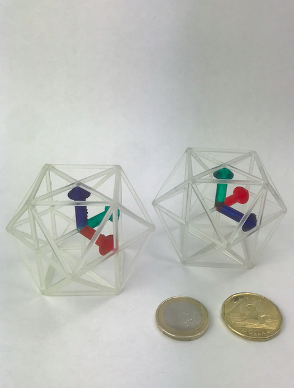
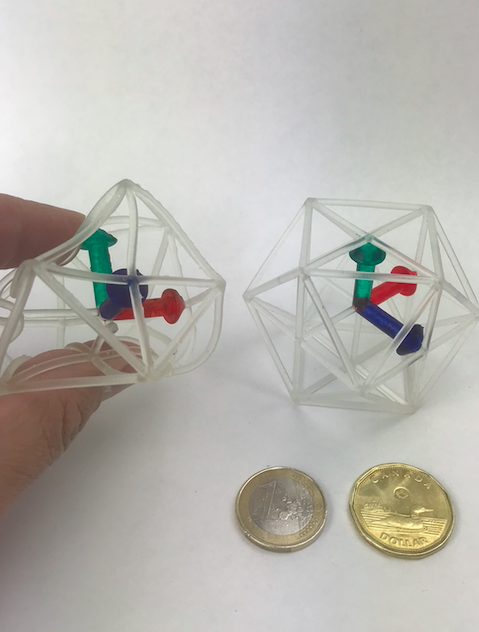
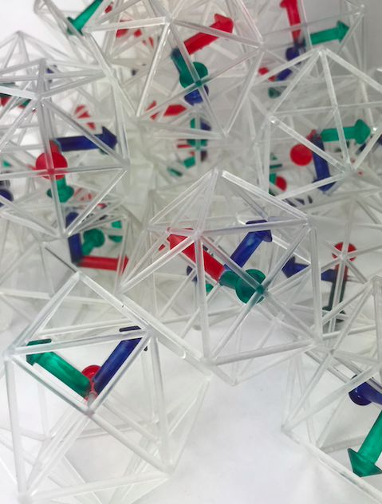

# coordinate-frame

This repo provides an STL file to print a right-handed coordinate frame.
These frames can be use for teaching.
They found use in [CSC375H course](https://robotics.cs.toronto.edu/courses.html), lab visits, and different outreach events.

See the short feature of the robotics teaching lab in the UofT Magazine:
[Meet the ‘Cobot’ -- U of T Mississauga is home to one of Canada’s most advanced robotics teaching labs](https://magazine.utoronto.ca/campus/meet-the-cobot-utm-undergraduate-robotics-teaching-lab/)
See the large glossy image on page 40 of the
[2022 VPRI Annual Report](https://2022.research.utoronto.ca/2022_VPRI_Annual_Report.pdf)

---
### 3d printing

We use an SLA 3D printer (Form 2, Formlabs, MA, USA) to print the monolithic part -- one single part for a coordinate frame.
For soft and flexible 3d printed coordinate frames, we recommend to use Formlabs' flexible resin.
These frames can be bend, compress, stretch, and potentially survive a rough condition prevailing in robotic courses.

The image with coins (one Euro, one [loonie](https://en.wikipedia.org/wiki/Loonie)) for size comparison show two coordinate frames.
The left one is printed with Formlabs' Flexilbe 80A resin.
For the right one, clear V4 resin is used. 

  
  
  

---
### Dimensions

The side length is 50 mm, see [drawing in PDF](frame_%20truncatedCubes_Drawing.pdf).
See the images above which compare the actual size with a 1 Euro coin and a 1 CAD (Canadian Dollar) coin.

---
### Useful tools

- diagonal pliers
- whiteboard markers (red, green, blue)
- mineral oil

---
### License

MIT License

Copyright (c) 2019, Reinhard Grassmann
